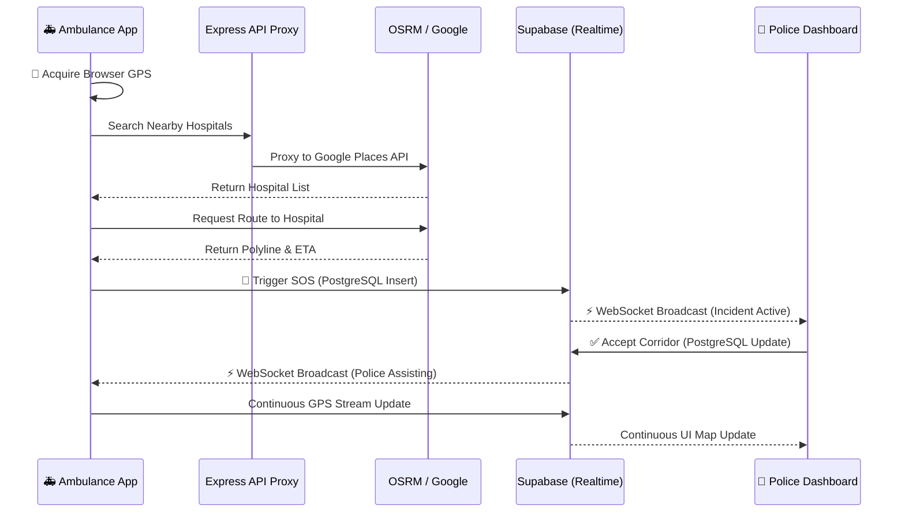
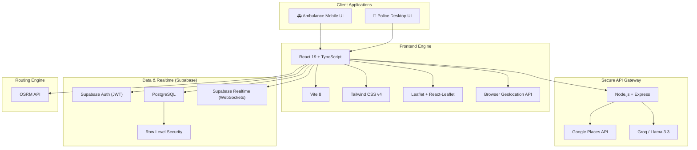
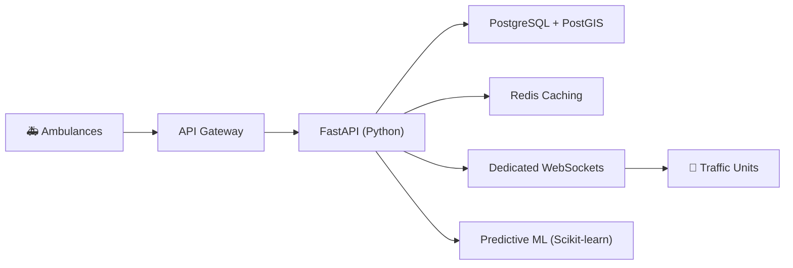

<div align="center">

# 🚑 LIFELANE
### Clear the Way. Save Critical Time.

<p align="center">
  <b>A real-time emergency coordination platform connecting ambulances and traffic-response personnel.</b>
</p>

<p align="center">
  
  
  
  
  
  
</p>

> **LIFELANE bridges the communication gap by providing traffic police with an ambulance's exact location, destination, route, and ETA in real-time, allowing intersections to be cleared *before* the ambulance arrives.**

<br/>

[](https://opensource.org/licenses/MIT)
[](http://makeapullrequest.com)
[]()

<br/>
</div>

---

## 📑 Table of Contents
- [The Problem vs. The Solution](#-the-problem-vs-the-solution)
- [How it Works (Core Workflow)](#-how-it-works)
- [Role Capabilities](#-user-roles)
- [Technical Architecture](#-technical-architecture)
- [Comprehensive Tech Stack](#-comprehensive-tech-stack)
- [Setup & Local Development](#-setup--local-development)
- [Roadmap & Future ML Vision](#-roadmap--future-vision)
- [Limitations & Disclaimers](#-limitations)

---

## 🛑 The Problem vs. The Solution

<table width="100%">
<tr>
<td width="50%" valign="top">
<h3>❌ Traditional Routing</h3>
<p>Information is fragmented. Sirens only warn drivers within a few hundred meters. The ambulance knows where it is going, but the police handling the intersections have zero advance visibility.</p>
<code>🚑 Ambulance → Traffic → Police (Unaware)</code>
</td>
<td width="50%" valign="top">
<h3>✅ The LIFELANE Approach</h3>
<p>Instantly synchronize the emergency state. By capturing live Browser GPS and broadcasting it over WebSockets, traffic responders can proactively clear the corridor.</p>
<code>🚑 Ambulance → 📍 GPS → 🚨 SOS → 👮 Police</code>
</td>
</tr>
</table>

---

## 🔄 How It Works

> [!IMPORTANT]
> **LIFELANE MVP:** The current working prototype is a synchronized two-device flow ensuring real-time operational visibility.



---

## 👥 User Roles

<div align="center">
  
| 🚑 Ambulance Operator | 👮 Traffic Police | 🛡️ Administrator |
| :--- | :--- | :--- |
| **Mobile-First Interface** | **Dark-Themed Operations Desk** | **High-Level Analytics Desk** |
| • Live GPS tracking<br>• Hospital destination search<br>• OSRM Route & ETA Preview<br>• One-tap SOS trigger<br>• AERO AI Assistance | • Multi-feed global map view<br>• Instant incoming SOS alerts<br>• Route & destination visibility<br>• Acknowledge & manage corridor | • Active emergency roster<br>• Fleet visibility monitoring<br>• System analytics |

</div>

---

## 🏗️ Technical Architecture

<details>
<summary><b>Click to expand detailed Architecture Diagram</b></summary>
<br>


</details>

### 📡 Data Flow Deep Dive
- **GPS Engine:** Built strictly on `navigator.geolocation.watchPosition()`, tracking high-accuracy coordinates, speed, and heading. Includes robust fallback states (`denied`, `searching`, `stale`).
- **Realtime Sync:** Rather than managing custom WebSockets and Redis, LIFELANE leverages **Supabase Realtime**, subscribing React clients directly to PostgreSQL logical replication logs.
- **Security:** Node.js/Express acts exclusively as a secure proxy to prevent exposing Google Places and Groq API keys to the client browser. Authorization is handled at the database level via Supabase RLS.

---

## 💻 Comprehensive Tech Stack

| Category | Technology | Purpose |
| :--- | :--- | :--- |
| **Frontend Framework** | React 19 | Builds the highly reactive web application |
| **Build Tool** | Vite 8 | Ultra-fast development server and production builds |
| **Language** | TypeScript | Ensures type-safe enterprise-grade code |
| **UI / Styling** | Tailwind CSS v4 | Rapid styling and responsive UI design |
| **Mapping Engine** | Leaflet & React-Leaflet | Renders interactive maps and custom SVG markers |
| **GPS** | Browser Geolocation API | Acquires and streams live ambulance location |
| **Routing** | OSRM | Calculates exact road network routes, distance, and ETA |
| **API Gateway** | Node.js & Express.js | Securely proxies requests to external paid APIs |
| **Backend & DB** | Supabase (PostgreSQL) | Serves as the core relational database and BaaS |
| **Auth & Security** | Supabase Auth & RLS | Manages JWT sessions and strict Row Level Security |
| **State Sync** | Supabase Realtime | Broadcasts live emergency coordinates across clients |
| **Hospital Discovery** | Google Places API | Locates valid nearby medical facilities dynamically |
| **AI Inference** | Groq API (Llama 3.3) | Powers the AERO AI conversational assistant |
| **Analytics** | Recharts | Powers administrative charts and metric visualization |

---

## 🚀 Setup & Local Development

> [!NOTE]
> **Prerequisites:** Node.js (v18+), a Supabase project, a Groq API Key, and a Google Maps API Key.

**1. Clone the Repository**
```bash
git clone https://github.com/your-username/AERO-main.git
cd AERO-main
```

**2. Install Dependencies**
```bash
npm install
```

**3. Configure Environment**
Create a `.env` file in the root directory:
```env
# Frontend (Vite)
VITE_SUPABASE_URL=your_supabase_project_url
VITE_SUPABASE_ANON_KEY=your_supabase_anon_key

# Backend Proxies (Express)
GROQ_API_KEY=your_groq_api_key
GOOGLE_MAPS_API_KEY=your_google_maps_key
```

**4. Provision Database**
1. Open your Supabase SQL Editor.
2. Execute the entire `supabase/full_setup.sql` script to generate tables and RLS policies.
3. Promote your police user account to the correct role:
   ```sql
   UPDATE profiles SET role = 'traffic_operator' WHERE email = 'police@example.com';
   ```

**5. Launch Development Servers**
```bash
npm run dev
```
*(Utilizes `concurrently` to spin up both Vite and Express instantly).*

---

## 🛤️ Roadmap & Future Vision

While the current architecture successfully proves the real-time coordination model, LIFELANE's enterprise roadmap includes migrating to a heavier Python-based data infrastructure.

<details>
<summary><b>View Planned Future Architecture</b></summary>
<br>


</details>

### 🔮 Future AI / ML Capabilities
Currently, AI is utilized strictly for the **AERO Conversational Assistant** via Groq/Llama. Future phases will introduce predictive ML models to:
- Dynamically adjust ETAs based on historic congestion anomalies.
- Intelligently position idle ambulance fleets based on predicted emergency demand.

---

## ⚠️ Limitations

> [!WARNING]
> **Prototype Disclaimer:** LIFELANE is an advanced development project demonstrating emergency-response coordination concepts. It is **not** a replacement for official medical dispatch systems or government traffic-control infrastructure.

- **GPS Dependency:** Accuracy relies entirely on the device hardware and browser OS permissions.
- **Traffic Interfacing:** LIFELANE provides visibility to human operators; it does not currently interface with physical municipal traffic lights.
- **Production Readiness:** Full deployment requires rigorous load testing, Dockerization, CI/CD pipelines, and extensive security penetration testing.

---

<div align="center">
  <p>Built with precision for emergency coordination.</p>
</div>
