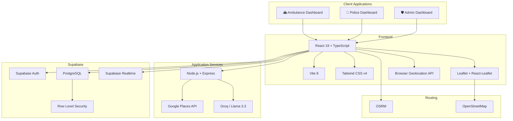
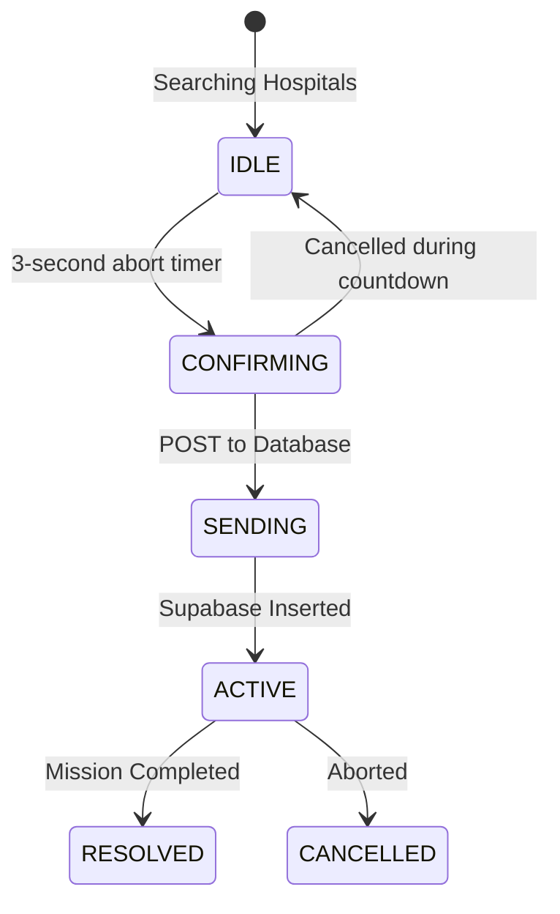
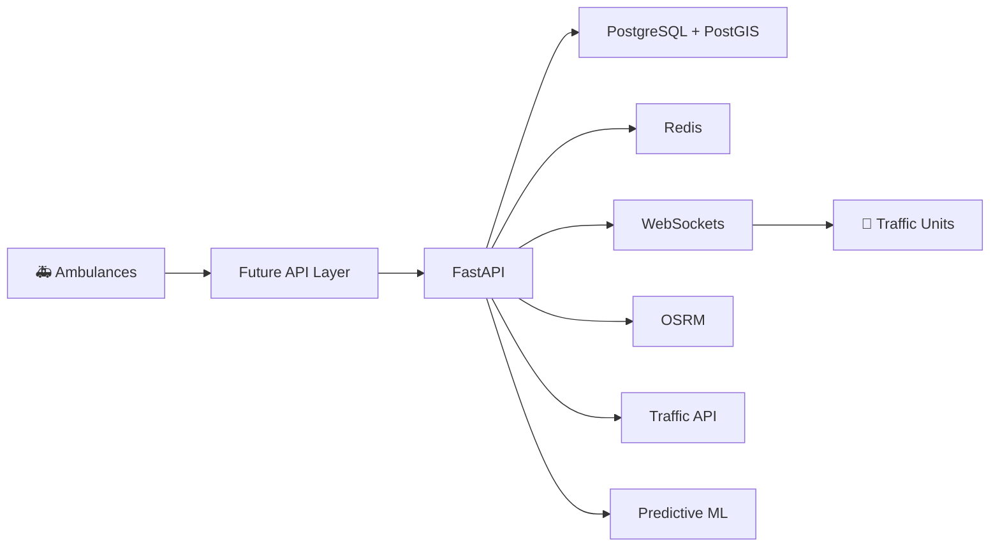

<div align="center">

# 🚑 LIFELANE
### Clear the Way. Save Critical Time.

Real-time emergency coordination between ambulances and traffic-response personnel.

**🚑 Ambulance → 📍 GPS → 🚨 SOS → ⚡ Realtime → 👮 Police**


</div>

<br>

> **LIFELANE helps traffic-response personnel see an ambulance's live location, destination, route, ETA and emergency state through a shared real-time operational interface.**

<br>

## 🖼️ Product Interface

<table align="center" width="100%">
  <tr>
    <td align="center" width="50%"><b>🚑 Ambulance Dashboard</b></td>
    <td align="center" width="50%"><b>👮 Police Dashboard</b></td>
  </tr>
  <tr>
    <td align="center"></td>
    <td align="center"><i>Screenshot coming soon</i></td>
  </tr>
  <tr>
    <td align="center" width="50%"><b>🛡️ Admin Overview</b></td>
    <td align="center" width="50%"><b>🤖 AERO AI Assistant</b></td>
  </tr>
  <tr>
    <td align="center"><i>Screenshot coming soon</i></td>
    <td align="center"><i>Screenshot coming soon</i></td>
  </tr>
</table>

---

## 💡 What is LIFELANE?

LIFELANE connects an ambulance and traffic-response personnel through a shared real-time emergency view.

**The ambulance shares:**
- Precise GPS location
- Target hospital destination
- OSRM-calculated route
- Estimated Time of Arrival (ETA)
- Emergency severity status

**The responder receives:**
- Instant emergency SOS alert
- Live ambulance position on a map
- Destination and route path
- Operational status

**The objective:**
Reduce coordination delays and provide better situational awareness so intersections can be managed *before* the ambulance arrives.

---

## 🛑 The Problem

### Traditional Situation
```text
🚑 Ambulance
    ↓
  Traffic
    ↓
Communication Fragmentation
    ↓
👮 Traffic Responder (Unaware)
```
Information is fragmented. The ambulance knows where it's going, but the police handling the intersections often do not have immediate visibility. 

### LIFELANE
```text
🚑 Ambulance
    ↓
  📍 GPS
    ↓
  🚨 SOS
    ↓
☁️ Shared Emergency State
    ↓
👮 Traffic Responder (Prepared)
```
Creates a unified, instantaneous digital corridor.

---

## 🔑 The Solution

LIFELANE solves coordination delays through 7 key features:
- Live Browser Geolocation tracking
- Hospital destination selection via Google Places API
- Road route calculation using OSRM
- Distance and ETA metrics
- Instant SOS broadcasting
- Realtime emergency synchronization
- Dedicated responder visibility dashboard

---

## 🚨 Current MVP (Two-Device Concept)

**LIFELANE is a production-oriented emergency-response coordination prototype, with a working real-time ambulance-to-police MVP and a roadmap toward production deployment.**

The core working concept is a two-role emergency coordination flow across two devices:

### Device 1: 🚑 Ambulance (Mobile-friendly UI)
### Device 2: 👮 Traffic Police (Operational Desktop UI)

**Current Flow:**
```text
Ambulance
   ↓
  GPS
   ↓
Hospital
   ↓
 Route
   ↓
  ETA
   ↓
  SOS
   ↓
Supabase
   ↓
Realtime
   ↓
 Police
```
The core objective is real-time emergency visibility between these two roles.

---

## 🔄 Core Workflow

**Current MVP Emergency Flow**

```mermaid
flowchart LR
    A["🚑 Ambulance"] --> B["📍 GPS Location"]
    B --> C["🏥 Hospital Selection"]
    C --> D["🗺️ OSRM Routing"]
    D --> E["📏 Distance + ETA"]
    E --> F["🚨 SOS"]
    F --> G["☁️ Supabase"]
    G --> H["⚡ Supabase Realtime"]
    H --> I["👮 Police Dashboard"]
    I --> J["🚨 Emergency Coordination"]
    J --> K["🏥 Hospital"]
```



---

## 👥 User Roles

<table align="center" width="100%">
  <tr>
    <td width="33%">
      <h3>🚑 Ambulance Operator</h3>
      <ul>
        <li>✅ Start emergency</li>
        <li>✅ Share GPS</li>
        <li>✅ Choose destination</li>
        <li>✅ Calculate route</li>
        <li>✅ View ETA</li>
        <li>✅ Trigger SOS</li>
        <li>✅ Monitor emergency state</li>
      </ul>
    </td>
    <td width="33%">
      <h3>👮 Traffic Police</h3>
      <ul>
        <li>✅ Receive emergency alert</li>
        <li>✅ View ambulance</li>
        <li>✅ View route</li>
        <li>✅ View destination</li>
        <li>✅ View emergency state</li>
        <li>✅ Coordinate response</li>
      </ul>
    </td>
    <td width="33%">
      <h3>🛡️ Administrator</h3>
      <ul>
        <li>✅ Operational overview</li>
        <li>🟡 Emergency monitoring</li>
        <li>🟡 Fleet visibility</li>
        <li>🟡 Responder visibility</li>
        <li>🟡 Analytics</li>
      </ul>
    </td>
  </tr>
</table>

---

## 📊 Feature Matrix

| Feature | Status | Technology |
| --- | :---: | --- |
| Landing Page | ✅ | React |
| Authentication | ✅ | Supabase Auth |
| Role Routing | ✅ | React Router |
| GPS | ✅ | Browser Geolocation API |
| Hospital Search | ✅ | Google Places API |
| Hospital Selection | ✅ | React |
| Map | ✅ | Leaflet |
| Route | ✅ | OSRM |
| Distance | ✅ | OSRM |
| ETA | ✅ | OSRM |
| SOS | ✅ | Supabase PostgreSQL |
| Realtime Emergency Sync | ✅ | Supabase Realtime |
| Police Dashboard | ✅ | React + Supabase |
| AERO AI | ✅ | Groq + Llama 3.3 |
| Admin Analytics | 🟡 | Recharts |
| Live Traffic Delay APIs | 🔵 | Future |
| Predictive ETA | 🔵 | Future ML |
| Advanced Geospatial Queries | 🔵 | Future PostGIS |
| Redis Pub/Sub | 🔵 | Future |
| Dockerization | 🔵 | Future |

---

## 💻 Tech Stack

### Frontend
| Technology | Purpose |
| --- | --- |
| React 19 | UI Components |
| Vite 8 | Build tooling |
| TypeScript | Type safety |
| Tailwind CSS v4 | Styling and Design System |

### Maps & Location
| Technology | Purpose |
| --- | --- |
| Leaflet | Interactive mapping engine |
| React-Leaflet | React integration for Leaflet |
| OpenStreetMap | Open-source map tile data |
| Browser Geolocation API | Live device GPS |

### Backend & Data
| Technology | Purpose |
| --- | --- |
| Node.js | Server runtime environment |
| Express.js | Secure API proxy layer |
| Supabase | Managed backend platform |
| PostgreSQL | Core relational database |
| Supabase Auth | User authentication (JWT) |
| Supabase RLS | Authorization and row-level security |
| Supabase Realtime | Real-time WebSocket synchronization |

### External Services
| Technology | Purpose |
| --- | --- |
| Google Places API | Real-time hospital discovery |
| OSRM | Road routing and ETA calculation |
| Groq | High-speed AI inference |
| Llama 3.3 | Core model for AERO AI |

### Analytics & Development
| Technology | Purpose |
| --- | --- |
| Recharts | Admin dashboard analytics |
| Git | Version control |
| GitHub | Repository hosting |

---

## 🏗️ Technical Architecture



---

## 📡 Detailed Technical Working

### Realtime Architecture
LIFELANE currently uses **Supabase Realtime** rather than maintaining a custom WebSocket + Redis infrastructure.
```text
🚑 Ambulance
     ↓
Emergency state
     ↓
Supabase (PostgreSQL Insert/Update)
     ↓
Realtime event (logical replication)
     ↓
👮 Police Dashboard
     ↓
UI updates dynamically
```

### GPS Architecture
Built on the native `navigator.geolocation.watchPosition()` API, tracking:
* Latitude
* Longitude
* Accuracy (meters)
* Timestamp
* Speed & Heading (when available)

The application handles various permission states including: `granted`, `denied`, `unavailable`, `loading`, and `low accuracy`. Accuracy is hardware dependent.

### Map Architecture
```text
React
 ↓
React-Leaflet
 ↓
Leaflet
 ↓
OpenStreetMap
```
Handles map rendering, custom SVG status markers, dynamic map centering based on moving bounds, and responsive behavior for mobile environments.

### Routing Architecture
```text
Ambulance Coordinates
         +
Hospital Coordinates
         ↓
       OSRM
         ↓
    Road Route
         +
      Distance
         +
        ETA
```
*Note: OSRM currently provides route-based ETA based on standard road network speeds. Live dynamic congestion-aware ETA is a future planned feature.*

### Hospital Discovery
```text
Ambulance GPS
         ↓
Express Proxy Server
         ↓
Google Places API (New)
         ↓
Nearby Hospitals
         ↓
Hospital Selection UI
```

---

## 🆘 SOS Lifecycle



---

## 🤖 AERO AI

AERO is the intelligent conversational assistant within LIFELANE.

**Current implementation:**
```text
User
 ↓
AERO Assistant UI
 ↓
Groq API Proxy
 ↓
Llama 3.3 Model
 ↓
Response
```
AERO currently provides conversational AI assistance for operators. *(Note: AERO does not currently perform predictive traffic ML or automated ETA adjustment).*

---

## 🔐 Authentication & Security

- **Authentication (Who you are):** Managed by Supabase Auth (JWT Sessions).
- **Authorization (What you can access):** Managed by strictly enforced Row Level Security (RLS). Database policies ensure that Ambulance operators can only edit their own incidents, while authorized Police operators can view active global incidents.
- **Server-Side API Proxying:** Node.js/Express acts as a secure gateway, ensuring sensitive API keys (Google Places, Groq) are never exposed to the browser.

---

## 🗄️ Database Schema

The database resides in PostgreSQL via Supabase.
**Core verified entities (`supabase/full_setup.sql`):**
* `profiles`: Links to auth.users, stores roles (`ambulance_operator`, `traffic_operator`, `admin`).
* `emergency_incidents`: Tracks the ambulance, destination hospital, live coordinates, speed, ETA, route geometry (JSONB), and corridor status.
* `ai_conversations` & `ai_messages`: Persists historical chat data for the AERO assistant.

---

## 📂 Project Structure

```text
AERO-main/
├── server/
│   └── index.js                 # Express API Proxy
├── src/
│   ├── assets/                  # Images and static files
│   ├── components/              # Shared UI & Maps
│   ├── features/                # Domain specific code
│   │   ├── admin/
│   │   ├── ai/
│   │   ├── ambulance/
│   │   ├── auth/
│   │   └── police/
│   ├── hooks/                   # Custom React hooks
│   ├── services/                # External API integration
│   └── App.tsx                  # Application routing
├── supabase/
│   └── full_setup.sql           # Verified database schema
├── package.json                 # Dependencies & scripts
└── vite.config.ts               # Bundler configuration
```

---

## 🚀 Setup & Local Development

**1. Clone & Install**
```bash
git clone <repository_url>
cd AERO-main
npm install
```

**2. Environment Setup**
Copy `.env.example` to `.env` and fill out your keys. Never expose secrets to the public repository.
```env
# Frontend variables (Vite)
VITE_SUPABASE_URL=YOUR_VALUE_HERE
VITE_SUPABASE_ANON_KEY=YOUR_VALUE_HERE

# Backend Proxies (Express)
GROQ_API_KEY=YOUR_VALUE_HERE
GOOGLE_MAPS_API_KEY=YOUR_VALUE_HERE
```

**3. Database Setup**
Execute the contents of `supabase/full_setup.sql` in your Supabase SQL Editor. Update your police user's role:
`UPDATE profiles SET role = 'traffic_operator' WHERE email = 'YOUR_VALUE_HERE';`

**4. Run Development Servers**
```bash
npm run dev
```
*(This uses `concurrently` to boot both the Vite frontend and Node/Express backend simultaneously).*

---

## 🧪 Testing

- **Build / Typecheck:** `npm run build` executes `tsc -b` for strict type validation.
- **Linting:** `npm run lint` uses `oxlint` for high-speed analysis.
- *Automated unit and E2E test coverage is currently limited/not yet implemented for this prototype MVP.*

---

## 📊 Current Implementation Status

| Area | Status |
| --- | :---: |
| Product concept | ✅ |
| Frontend | ✅ |
| Design system | ✅ |
| Authentication | ✅ |
| GPS | ✅ |
| Maps | ✅ |
| Hospital discovery | ✅ |
| Routing | ✅ |
| ETA | ✅ |
| SOS | ✅ |
| Realtime | ✅ |
| Police dashboard | ✅ |
| AERO AI | ✅ |
| Admin analytics | 🟡 |
| Live traffic API | 🔵 |
| Predictive ML ETA | 🔵 |
| PostGIS | 🔵 |
| Custom WebSockets / Redis | 🔵 |
| Docker | 🔵 |
| Production deployment | 🔵 |

---

## 🛤️ Roadmap

- **Phase 1 — Design Foundation:** ✅
- **Phase 2 — Frontend Application:** ✅
- **Phase 2.5 — Public + Auth + GPS + Maps:** ✅
- **Phase 3 — Backend Hardening:** 🟡
- **Phase 4 — Production Authentication & Security:** 🔵
- **Phase 5 — Advanced Geospatial Infrastructure:** 🔵
- **Phase 6 — Traffic Intelligence:** 🔵
- **Phase 7 — Predictive ETA:** 🔵
- **Phase 8 — Advanced Analytics:** 🔵
- **Phase 9 — Production Deployment:** 🔵
- **Phase 10 — Real-World Pilot:** 🔮

---

## 🔵 Future Architecture

Planned Production Architecture — Not Yet Implemented



---

## 🔮 Future AI / ML

Future possibilities for LIFELANE data utilization:
* Predictive ETA adjustment based on real-time congestion
* Route optimization and alternate pathing
* Emergency demand prediction
* Responder fleet positioning algorithms
* Anomaly detection for unusual delays

*(Predictive ML requires robust historical operational data and is slated for late-stage development).*

---

## 🛠️ Production Readiness

**Application:**
- [x] Error handling
- [x] Loading states
- [ ] Comprehensive offline handling
- [x] GPS failure handling / fallbacks

**Security:**
- [x] Authentication
- [x] Authorization (Role-based)
- [x] Database RLS
- [x] Secrets management (via Express proxy)
- [ ] Strict rate limiting
- [ ] Comprehensive audit logging

**Infrastructure:**
- [ ] Application monitoring
- [ ] Automated backups
- [ ] CI/CD pipelines
- [ ] Scalability testing

**Operational:**
- [ ] Real-device field testing
- [ ] Responder workflow validation
- [ ] Authorized municipal traffic integration

---

## ⚠️ Limitations

- Browser GPS is heavily dependent on hardware capability and OS location permissions.
- OSRM route ETA is currently based on static road speeds and does not automatically equal live-traffic ETA.
- The current prototype does **not** control municipal traffic signals.
- Admin analytics are partially mock/static UI representations.
- Dedicated traffic integration and predictive ML are strictly future scope.
- Production emergency deployment requires extensive real-world validation and certification.

---

## 🌍 Why This Project Matters

LIFELANE attacks the communication fragmentation inherent in modern emergency transit. By creating shared location visibility and route transparency, responders gain critical situational awareness. Faster communication and scalable digital coordination mean earlier intersection clearance, fewer traffic delays, and ultimately, saved lives.

---

## 🎓 Viva Section

### Explain LIFELANE in 30 Seconds
"LIFELANE is a real-time emergency coordination platform. It allows an ambulance to select a destination hospital and instantly broadcast its live GPS route to a centralized traffic-police dashboard via Supabase WebSockets. This gives traffic responders the advance visibility they need to clear congestion before the ambulance arrives."

**Explain the architecture in 30 seconds**
"It's a React/Vite frontend using Leaflet for maps and OSRM for routing, backed by a Node/Express API proxy for external services. Data is persisted in PostgreSQL and synchronized in real-time across devices using Supabase Realtime WebSockets."

**Explain the GPS system**
"It uses the browser's native `navigator.geolocation.watchPosition()` API to stream high-accuracy coordinates, speed, and heading, while state machines handle fallbacks for denied or degraded permissions."

**Explain the realtime system**
"Instead of manually managing WebSockets and Redis, we leverage Supabase Realtime, which listens to PostgreSQL logical replication logs and broadcasts database row changes to subscribed React clients instantly."

**Explain the database**
"We use PostgreSQL managed by Supabase, relying heavily on UUIDs, strict typing, and Row Level Security (RLS) to ensure data isolation between different operational roles."

**Explain why Supabase**
"It provides an instant PostgreSQL database, robust JWT authentication, and out-of-the-box WebSocket synchronization, which allowed us to rapidly build the MVP without managing complex realtime backend infrastructure."

**Explain why OSRM**
"OSRM (Open Source Routing Machine) is extremely fast and specifically optimized for calculating shortest-path road network routes and ETAs based on OpenStreetMap data."

**Explain why Leaflet**
"Leaflet is a lightweight, open-source mapping library that integrates perfectly with React and allows us to easily render custom map tiles, polylines, and dynamic SVG markers without heavy vendor lock-in."

**Explain AERO AI**
"AERO is a conversational assistant built into the application, powered by the Llama 3.3 model via the Groq API. It provides intelligent operational assistance to users, with prompts proxied securely through our Node.js server."

---

## ❓ FAQ

**What is LIFELANE?**
An emergency coordination platform linking ambulances with traffic response units.

**Who uses it?**
Ambulance drivers (mobile) and traffic police dispatchers (desktop).

**How does the ambulance send SOS?**
The operator selects a hospital and confirms the SOS, which writes a record containing their route and GPS data directly to the database.

**How does police receive the emergency?**
Supabase Realtime detects the database insert and broadcasts the payload to the Police dashboard via WebSockets.

**How does routing work?**
Coordinate pairs are sent to OSRM, which returns a GeoJSON polyline and distance/ETA metrics.

**Does OSRM provide live traffic?**
No, currently it provides base road-network ETAs.

**Does LIFELANE control traffic signals?**
No, it provides situational awareness to human officers who can manage intersections.

**Why Node/Express?**
It acts as a secure API gateway, ensuring our Google Places and Groq API keys are never exposed to the client browser.

**What AI model is used?**
Llama 3.3, served through Groq for high-speed inference.

**Is it production-ready?**
No, it is a production-oriented prototype requiring further validation, security hardening, and infrastructure work.

**What is planned next?**
Migrating the backend logic to a dedicated Python/FastAPI service and implementing PostGIS spatial queries.

---

> **DISCLAIMER:** LIFELANE is currently a prototype/development project designed to demonstrate emergency-response coordination concepts. It is not a replacement for official emergency services, dispatch systems, medical services, or government traffic-control infrastructure.

<div align="center">
  <p>License: Not yet specified.</p>
</div>
