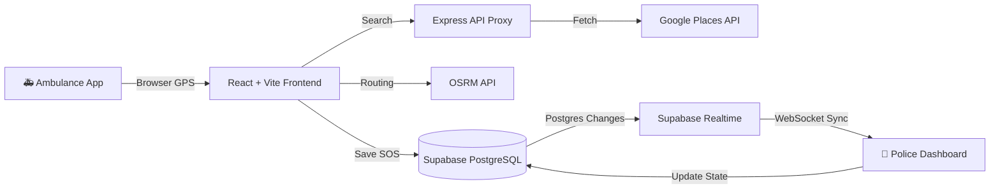
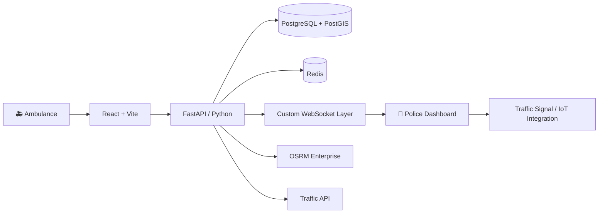

<div align="center">
  
# 🚑 LIFELANE

### Clear the Way. Save Critical Time.

> A real-time emergency coordination platform connecting ambulances with traffic-response personnel through GPS, maps, routing, emergency alerts, and live operational visibility.


</div>

---

## ⚡ Quick Value Proposition

**🚑 AMBULANCE → 📍 LOCATION → 🚨 SOS → ⚙️ LIFELANE → 👮 TRAFFIC RESPONSE → 🗺️ LIVE COORDINATION → 🏥 HOSPITAL**

LIFELANE bridges the communication gap between active ambulances and traffic police. By capturing live GPS data and syncing it instantly to a centralized operational dashboard, it allows traffic responders to see incoming emergencies, monitor live routes, and proactively clear congestion before the ambulance arrives.

---

## 🛑 The Problem

### Today
- An ambulance knows exactly where it is and where it needs to go.
- Traffic police usually do **not** have immediate advance visibility of the ambulance's route.
- Sirens only warn drivers within a few hundred meters.
- Destination and exact ETA are rarely communicated to the personnel who can actually clear intersections ahead of time.

### The Result
Critical time is lost in traffic bottlenecks. Coordination delays cost lives.

---

## 💡 The Solution

### LIFELANE
Creates a shared emergency coordination layer that puts the ambulance and traffic personnel on the exact same map, in real-time.

```text
Ambulance
    ↓
Browser GPS
    ↓
Hospital Selection (Google Places API)
    ↓
Route + ETA (OSRM)
    ↓
SOS Triggered
    ↓
Supabase Database
    ↓
Supabase Realtime Sync
    ↓
Traffic Police Dashboard
    ↓
Live Emergency View & Corridor Clearance
```

---

## 🚨 Current MVP (Two-Device Concept)

The **core working prototype** centers entirely around a synchronized two-device flow:

- **DEVICE 1: 🚑 Ambulance Unit** (Mobile-friendly interface)
- **DEVICE 2: 👮 Traffic Police** (Operational Desktop Dashboard)

**CURRENTLY WORKING:**
✅ Ambulance fetches precise geolocation via Browser GPS.
✅ Ambulance discovers real nearby hospitals dynamically using the Google Places API.
✅ Route geometry and ETAs are calculated instantly via OSRM.
✅ SOS writes the active incident to a PostgreSQL database.
✅ Traffic Police dashboard receives the incident instantaneously via Supabase Realtime WebSockets.
✅ Traffic Police can "Accept" the emergency, acknowledging they are managing the corridor.
✅ Live location tracks on a unified map.

---

## 🗺️ How The System Works

### ✅ Current Working Architecture
This is how LIFELANE operates *today* in this repository.



### 🔵 Planned Production Architecture
This is the roadmap vision for enterprise-scale deployments.



---

## 📊 Current Project Status

| Area | Status |
| :--- | :---: |
| Project concept & architecture | ✅ |
| React/Vite frontend foundation | ✅ |
| UI/UX Design System (Tailwind v4) | ✅ |
| Authentication UI & Protected Routes | ✅ |
| Supabase Auth Integration | ✅ |
| Role-based Dashboards (Ambulance / Police) | ✅ |
| Live GPS integration (Browser API) | ✅ |
| Leaflet map rendering & live markers | ✅ |
| Real Hospital Search (Google Places Proxy) | ✅ |
| Live Route & ETA (OSRM) | ✅ |
| Real SOS backend persistence (PostgreSQL) | ✅ |
| Live Incident Sync (Supabase Realtime) | ✅ |
| AI Chatbot (Groq API) | ✅ |
| Analytics Dashboard | 🟡 |
| FastAPI / Python backend | 🔵 |
| PostGIS Spatial Queries | 🔵 |
| Custom Redis / WebSocket server | 🔵 |
| Advanced Traffic APIs (Congestion) | 🔵 |
| AI/ML Predictive Analytics | 🔮 |
| Production Docker Deployment | 🔮 |

*Legend: ✅ Implemented  \|  🟡 In Progress  \|  🔵 Planned  \|  🔮 Future/Research*

---

## 🏗️ What We Have Built So Far

### Product Foundation
- A fully defined emergency coordination model isolating roles for Ambulance operators, Traffic Police, and System Admins.

### Frontend Foundation
- A robust **React 19 + Vite 8** single-page application.
- Comprehensive **Tailwind CSS v4** design system.
- Reusable UI primitives (Cards, Badges, Modals, Skeleton loaders).
- Dedicated dark-mode operational theme designed for low cognitive load and high contrast.

### Authentication & Security
- Fully functioning Sign-in and Registration flows using **Supabase Auth**.
- Strict Row Level Security (RLS) policies enforcing data isolation at the database layer.

### Maps & GPS
- **Leaflet + React-Leaflet** integration for performant mapping.
- Native `navigator.geolocation.watchPosition()` for high-accuracy live tracking.
- Interactive routing polylines and custom SVG status markers.

### Backend & API
- **Express.js API Proxy** designed to securely shield sensitive API keys (Google Maps, Groq).
- A powerful **Supabase PostgreSQL** schema encompassing profiles, emergency incidents, and AI chat histories.
- Complete **Supabase Realtime** channel broadcasting to sync state without polling.

---

## 🎯 Product Experience

LIFELANE is engineered to feel like a modern **Emergency Operations Center**. 

**Design Principles:**
- **Speed & Clarity:** Micro-interactions and immediate feedback loops.
- **Minimal Cognitive Load:** Vital information (ETA, Distance, Priority) is prominently isolated.
- **Mobile-First Ambulance:** Large hit targets, bold buttons, and high-contrast text for paramedics in moving vehicles.
- **Operational Police View:** A dark, multi-feed dashboard designed for desktop monitors in control rooms.

---

## 👥 User Roles

### 🚑 Ambulance Operator
| Features | Status |
| :--- | :---: |
| Authenticate & Connect | ✅ |
| Live GPS Tracking | ✅ |
| Search Local Hospitals | ✅ |
| View Route & ETA | ✅ |
| Trigger SOS Alert | ✅ |
| Chat with AI Assistant | ✅ |

### 👮 Traffic Response
| Features | Status |
| :--- | :---: |
| Monitor Global Map | ✅ |
| Receive Instant SOS Alerts | ✅ |
| View Ambulance Destination | ✅ |
| Accept Emergency Corridor | ✅ |
| Update Clearance Status | ✅ |

### 🛡️ Administrator
| Features | Status |
| :--- | :---: |
| System Overview UI | ✅ |
| Active Emergency Roster | 🟡 |
| Live Analytics | 🔵 |

---

## 🔄 Core Workflows

### Ambulance Journey
```text
LOGIN → ACQUIRE GPS → SEARCH HOSPITAL (Live) → PREVIEW ROUTE → CONFIRM SOS → BROADCAST EMERGENCY → DRIVE TO HOSPITAL
```

### Police Journey
```text
LOGIN → STANDBY → INCOMING ALERT RECEIVED (WebSocket) → VIEW AMBULANCE / ETA → ACCEPT CORRIDOR → COORDINATE TRAFFIC
```

---

## 🛠️ Technical Architecture

### GPS Technical Architecture
LIFELANE relies on the native `navigator.geolocation.watchPosition()` API, tracking:
- Latitude / Longitude
- Accuracy (meters)
- Speed & Heading (when hardware permits)

State machines handle gracefully falling back when GPS is *Searching*, *Stale*, or *Denied*.

### Map Technical Architecture
Built on `React-Leaflet` rendering `OpenStreetMap` tiles. The map automatically bounds to the active emergency, calculating the optimal viewport to display both the ambulance's current location and the destination hospital.

### SOS System Architecture
1. **IDLE:** Browsing hospitals.
2. **CONFIRMING:** User initiates SOS, a 3-second abort timer starts.
3. **SENDING:** Frontend POSTs to Supabase.
4. **ACTIVE:** Supabase inserts the record. `Supabase Realtime` broadcasts `postgres_changes` to all connected Police clients. 
5. **ACCEPTED:** Police acknowledge the incident, updating the record.

---

## 💻 Tech Stack

| Technology | Purpose | Status |
| :--- | :--- | :---: |
| **React 19** | Component-based UI framework | ✅ |
| **Vite 8** | High-speed frontend build tooling | ✅ |
| **TypeScript** | Type-safe development | ✅ |
| **Tailwind CSS v4** | Rapid, utility-first styling | ✅ |
| **Supabase (PostgreSQL)**| Core relational database & persistence | ✅ |
| **Supabase Auth** | JWT-based authentication | ✅ |
| **Supabase Realtime** | WebSocket state synchronization | ✅ |
| **Express / Node.js** | Secure server-side API proxy | ✅ |
| **Google Places API** | Live hospital discovery | ✅ |
| **OSRM** | Open-source road routing | ✅ |
| **Groq (Llama 3.3)** | Conversational AI assistant | ✅ |
| **Python / FastAPI** | Advanced backend services | 🔵 |
| **Redis** | Custom pub/sub and caching | 🔵 |
| **PostGIS** | Advanced spatial index querying | 🔵 |

---

## 🗄️ Database Design

The PostgreSQL schema heavily utilizes UUIDs, strict typing, and Row Level Security. 
Key Tables (Implemented):
- `profiles`: Role mapping (ambulance_operator vs traffic_operator).
- `emergency_incidents`: Core operational table containing `route_geometry` (JSONB), `destination_latitude`, `corridor_status`, and `eta_minutes`.
- `ai_conversations` & `ai_messages`: Chatbot history persistence.

---

## 📂 Project Structure

```
AERO-main/
├── server/
│   └── index.js                 # Express API Proxy (Groq, Google Places)
├── supabase/
│   └── full_setup.sql           # Complete Postgres schema, RLS, & triggers
├── src/
│   ├── assets/                  # Static media
│   ├── components/              # Shared UI & Leaflet Map components
│   ├── features/
│   │   ├── admin/               # Admin dashboard routes
│   │   ├── ai/                  # AERO Intelligence chatbot UI
│   │   ├── ambulance/           # Ambulance operator workflow
│   │   ├── auth/                # Login & Registration
│   │   └── police/              # Traffic police dashboard
│   ├── hooks/                   # Custom React hooks (useLocation, etc)
│   ├── services/                # API wrappers (Supabase, OSRM)
│   └── App.tsx                  # Main Router
├── vite.config.ts               # Vite configuration
└── package.json                 # Dependencies
```

---

## 🚀 Local Development

### Prerequisites
- Node.js (v18+)
- A Supabase Project
- Google Maps API Key
- Groq API Key

### 1. Clone & Install
```bash
git clone https://github.com/your-username/AERO-main.git
cd AERO-main
npm install
```

### 2. Environment Variables
Copy `.env.example` to `.env` and fill in your keys:
```env
# Supabase
VITE_SUPABASE_URL=https://your-project.supabase.co
VITE_SUPABASE_ANON_KEY=your-anon-key

# Backend Proxies
GROQ_API_KEY=gsk_your_key
GOOGLE_MAPS_API_KEY=AIza...
```

### 3. Database Setup
1. Go to your Supabase Dashboard → SQL Editor.
2. Paste and run the entire contents of `supabase/full_setup.sql`.
3. Manually update your created police user's role:
   `UPDATE profiles SET role = 'traffic_operator' WHERE email = 'police@example.com';`

### 4. Run the Stack
We use `concurrently` to spin up both the Vite frontend and Express backend:
```bash
npm run dev
```

---

## 🔐 Authentication & Security

- **Current:** Supabase Auth manages JWT sessions. The Express backend uses token verification middlewares to protect API proxy endpoints. Supabase Row Level Security (RLS) guarantees that users can only read/write data permitted by their `profiles.role`.
- **Planned:** Migration of complex business logic out of the frontend and into a hardened FastAPI backend, with strict API-gateway rate limiting.

---

## 🛤️ Roadmap

- [x] **Phase 1:** Core UI & Design System
- [x] **Phase 2:** Authentication & GPS Architecture
- [x] **Phase 3:** Real Hospital Search (Google Places) & OSRM Routing
- [x] **Phase 4:** Supabase PostgreSQL & Realtime Websockets (Current MVP)
- [ ] **Phase 5:** FastAPI Python Backend Foundation
- [ ] **Phase 6:** PostGIS Spatial Optimization
- [ ] **Phase 7:** Live Traffic API Integration (Congestion metrics)
- [ ] **Phase 8:** Advanced AI/ML Predictors

---

## 🤖 Future AI / ML

While LIFELANE currently uses **Groq (Llama 3.3)** for the conversational Assistant, future phases plan to implement predictive ML models to forecast ETA disruptions, intelligently position ambulance fleets based on historical demand, and recommend optimal emergency corridors. *(Note: Reliable predictive ML requires massive historical datasets which LIFELANE is designed to eventually collect).*

---

## ⚠️ Limitations & Production Considerations

> **LIFELANE is currently a prototype/development project intended to demonstrate emergency-response coordination concepts. It is not a replacement for official emergency services, dispatch systems, or government traffic-control infrastructure.**

- **GPS Reliability:** Completely dependent on the browser/hardware geolocation capabilities.
- **Traffic Interfacing:** Does NOT currently control physical municipal traffic lights.
- **Production Readiness:** Requires rigorous load testing, WebSocket reconnect hardening, and offline-capability engineering before real-world deployment.

---

## 🎓 LIFELANE in 30 Seconds

*"LIFELANE is a real-time emergency coordination platform. It allows an ambulance to select a destination hospital and instantly broadcast its live GPS route to a centralized traffic-police dashboard via WebSockets. This gives traffic responders the advance visibility they need to clear congestion before the ambulance arrives, ultimately saving critical time."*

**Explain it in 10 seconds:**
*"LIFELANE puts ambulances and traffic police on the exact same live map so they can coordinate emergency routes in real-time."*

---

## ❓ FAQ

**Q: Does it control traffic lights?**
No. It provides situational awareness to traffic police who can manually coordinate road clearance.

**Q: How does the Police dashboard update instantly?**
It uses Supabase Realtime, which listens to PostgreSQL logical replication logs and broadcasts database changes over WebSockets.

**Q: Why Express.js?**
It currently serves as a lightweight API proxy to hide sensitive API keys (Google Places, Groq) from the frontend browser.

**Q: Is it production-ready?**
No, it is an advanced functioning prototype MVP.

---

<div align="center">
  <p>License: Not yet specified.</p>
</div>
